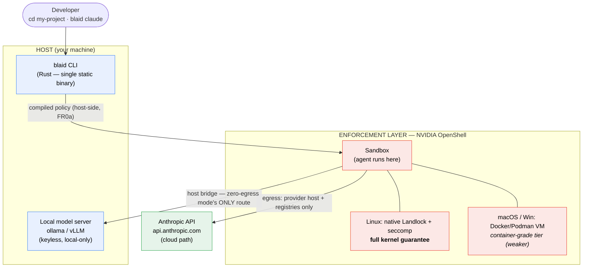
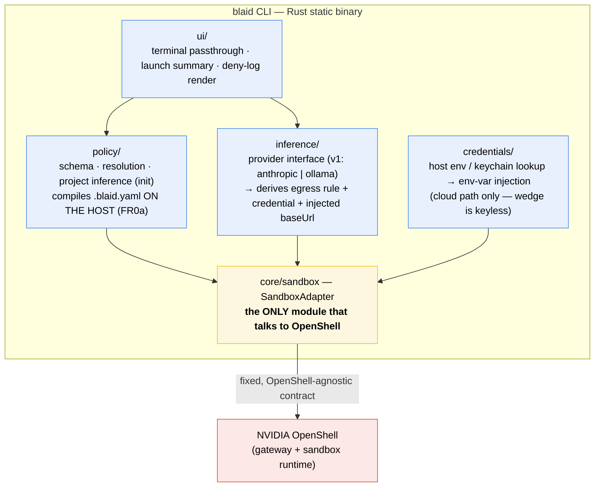
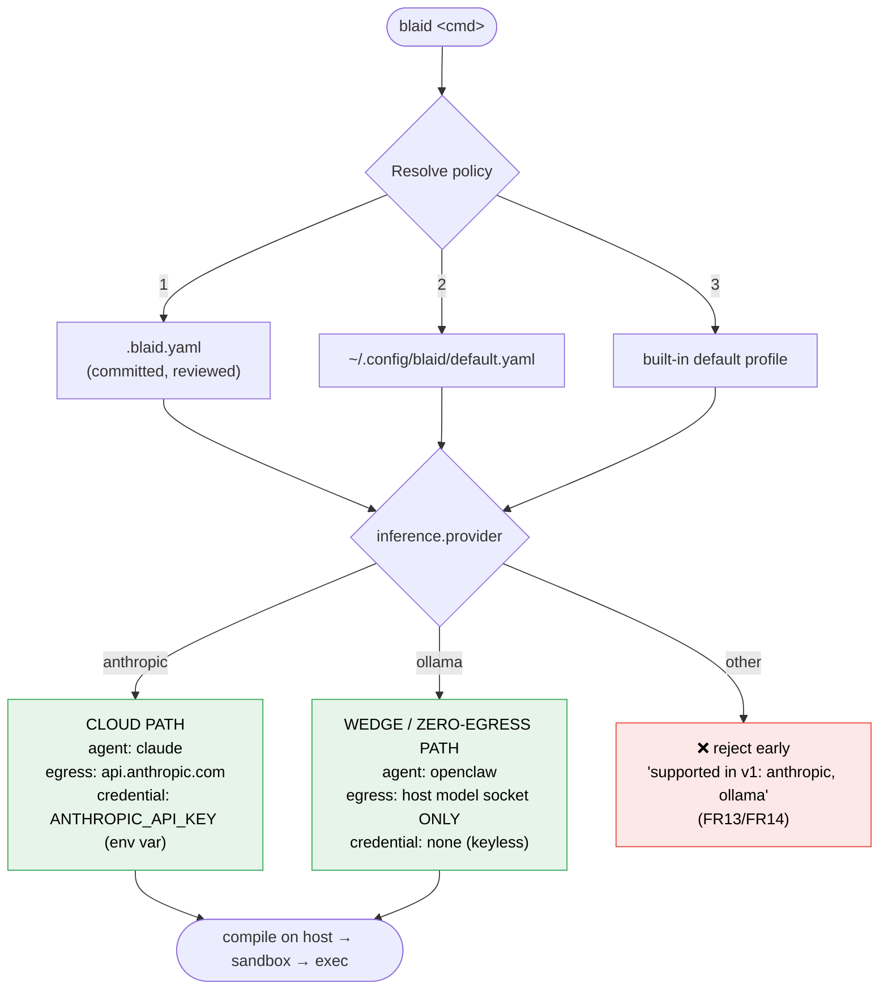
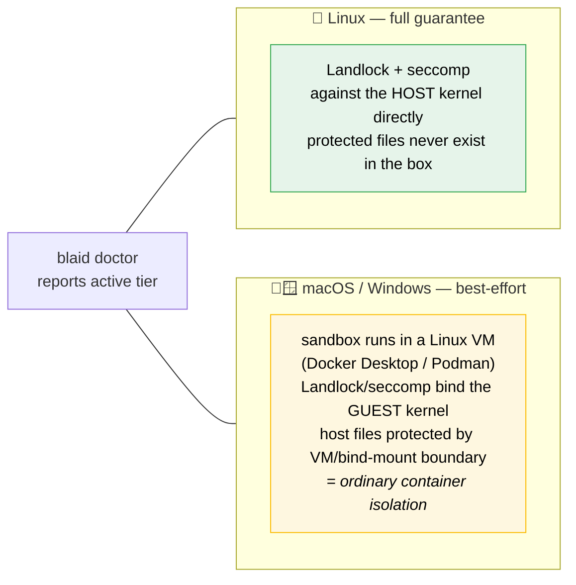
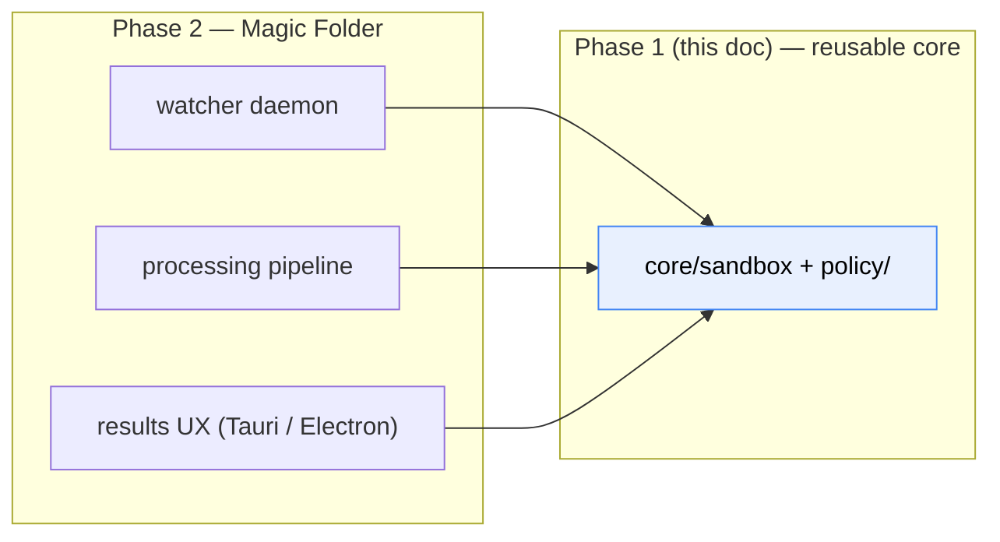

# Architecture — BLAID v1

> **Status:** Derived from [PRD v0.2](./PRD.md) §7 and the [PR/FAQ](./PRFAQ.md) · 2026-06-07
> **Scope:** Phase 1 (Safe-Mode Launcher). Phase 2 (Magic Folder) reuses `core/sandbox` + `policy/` unchanged.
>
> Diagrams are [Mermaid](https://mermaid.js.org/) — they render natively on GitHub and most Markdown viewers.

---

## 1. System overview

`blaid` is a single static Rust binary that sits **on the host**. It compiles a per-project policy, asks NVIDIA OpenShell to create a least-privilege sandbox, injects credentials + the inference `baseUrl`, then `exec`s the coding agent **inside** the box with the terminal attached. The sandbox is destroyed on exit.



---

## 2. Module architecture (the Rust core)

Everything **above** the `core/sandbox` adapter is pure, OpenShell-free, and unit-testable. Only the adapter imports OpenShell — this is what makes the alpha-churn risk survivable and the test pyramid (§13 of the PRD) possible.



### The adapter contract (the entire OpenShell surface)

```
SandboxAdapter
  create(compiledPolicy)           -> SandboxHandle | EnforcementError   # fail-closed origin (FR0)
  probe(handle)                    -> Ok | EnforcementViolation          # FR0 active check
  exec(handle, argv, env)          -> exitCode                           # terminal attached
  tailDenials(handle)              -> stream<DenyEvent>                  # FR8 deny-log
  hotReloadNetwork(handle, rules)  -> Ok | Err                           # FR9 allow <domain>
  destroy(handle)
```

Above this line: ours, pure, tested with **zero OpenShell**. Below it: mockable. `core/sandbox` + `policy/` is exactly the core Phase 2 (Magic Folder) reuses.

---

## 3. Launch sequence

```mermaid
sequenceDiagram
    actor Dev
    participant CLI as blaid CLI
    participant Pol as policy/
    participant Inf as inference/
    participant Cred as credentials/
    participant Adp as core/sandbox (adapter)
    participant Box as OpenShell sandbox
    participant Agent as Coding agent

    Dev->>CLI: blaid claude
    CLI->>Pol: resolve policy
    Note over Pol: 1. .blaid.yaml (project)<br/>2. ~/.config/blaid/default.yaml<br/>3. built-in default profile
    Pol->>Inf: provider = anthropic | ollama
    Inf-->>Pol: egress rule + credential req + baseUrl
    Pol->>Pol: compile policy ON HOST (FR0a — agent never sees it)
    CLI->>Cred: lookup required credential (cloud path only)
    Cred-->>CLI: ANTHROPIC_API_KEY (or none — keyless wedge)

    CLI->>Adp: create(compiledPolicy)
    Adp->>Box: establish Landlock/seccomp sandbox
    alt enforcement NOT confirmed
        Box-->>Adp: EnforcementError
        Adp-->>CLI: abort
        CLI-->>Dev: ❌ loud, specific error — NO "run anyway" (FR0)
    else enforcement active
        Adp->>Box: probe() — denied read + denied write + denied connect
        Note over Box: any probe SUCCEEDS → EnforcementViolation → abort
        Box-->>Adp: Ok (<100ms)
        CLI-->>Dev: launch summary line (paths, egress, agent, provider/model) (FR5)
        CLI->>Adp: exec(handle, ["claude"], env)
        Adp->>Agent: run inside box, terminal attached
        Agent-->>Dev: interactive session
        Box-->>CLI: deny events stream (FR8)
        Dev->>Agent: exit
        CLI->>Adp: destroy(handle)
    end
```

---

## 4. Policy resolution & the two v1 paths

The user picks an **agent** (runs in the box) and an **inference provider** (where the model runs) — two orthogonal choices. The provider choice *drives* the egress rule and credential automatically; the user never hand-edits host-bridge plumbing.



> **Zero-egress honesty (§6.2):** local mode means *no direct egress from the sandbox* — the sandbox still reaches the host model process, which itself has host internet. The honest guarantee: exfil now requires abusing the host model path, not a free outbound socket. For a true air-gap, restrict the host model process too. Not marketed as kernel-enforced zero-exfil.

---

## 5. Enforcement tiers by platform

The guarantee is strongest on Linux and explicitly weaker on macOS/Windows — `blaid doctor` reports which tier is active.



---

## 6. Key invariants

| ID | Invariant | Mechanism |
|----|-----------|-----------|
| **FR0** | Never launch unless enforcement is confirmed active. No "run anyway" path. | `create()` fails closed; active `probe()` inside the fresh box must see denied read **and** write **and** connect, or it aborts. |
| **FR0a** | The agent cannot read or alter the policy that governs it. | Policy is **compiled on the host before the sandbox exists** — the governing file never enters the box. |
| **FR4** | Wedge path is keyless; cloud path injects a session env var only. | Local Ollama needs no credential; `ANTHROPIC_API_KEY` injected as env (never written to disk in-box). |
| **Adapter isolation** | OpenShell alpha churn breaks at most one module. | All OpenShell calls confined behind the fixed `SandboxAdapter` contract. |

---

## 7. Phase 2 reuse boundary

Phase 2 (Magic Folder / AI Dropbox) adds a watcher daemon + processing pipeline + results UX — **zero new security architecture**. It builds entirely on the v1 `core/sandbox` + `policy/` modules; the React/TS UI ships via Tauri (shares the Rust core) or Electron (shells out to the binary).


